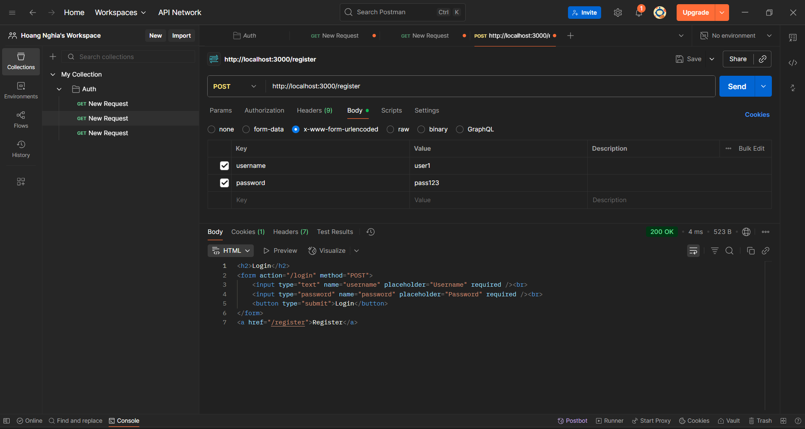
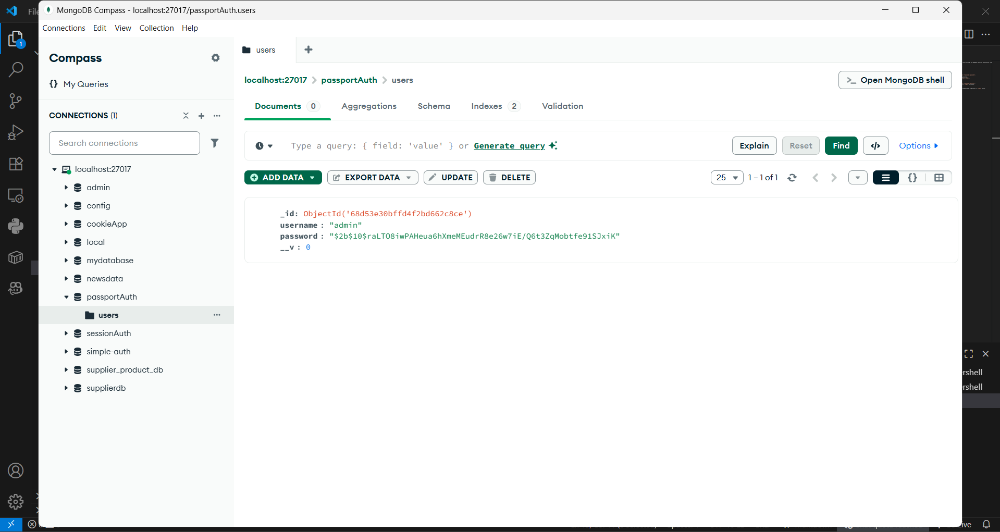
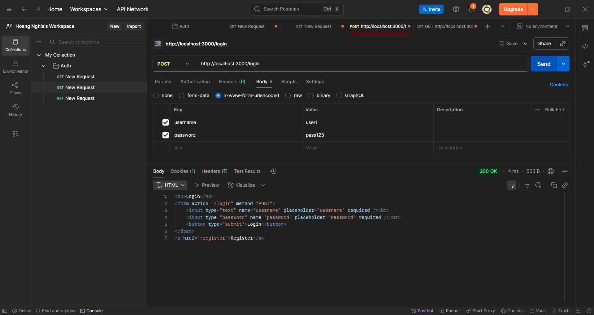
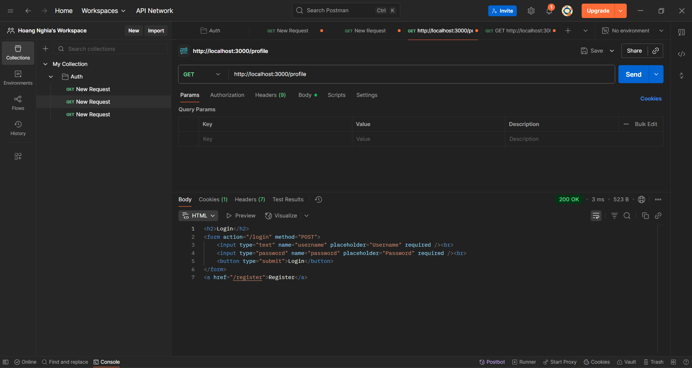
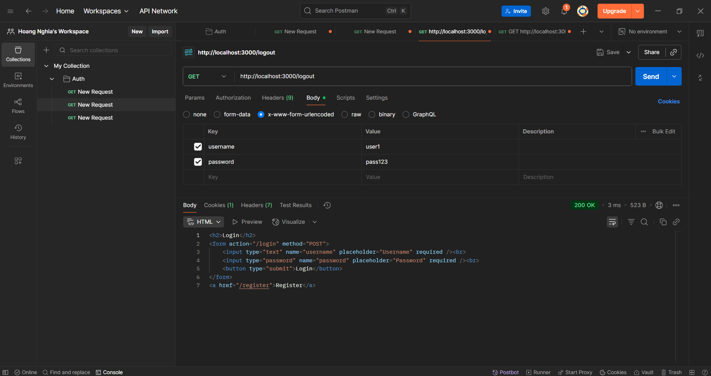

# Local Passport Website

A web-based authentication system using Passport.js with local strategy and MongoDB, supporting registration, login, profile access, and logout.

## Setup
- Install MongoDB and run on `mongodb://127.0.0.1:27017`.
- Install dependencies: `npm install`.
- Start the server: `npm start` (port 3000).

## Testing with Postman or Browser

- **Register**: 
  - **GET**: http://localhost:3000/register
    - Description: Displays the registration form.
  - **POST**: http://localhost:3000/register
    - Request Body (raw JSON): `{"username":"user1","password":"pass123"}`.
    - Expected: Redirects to `/login` after successful registration.
    - Check in database: `mongo`, `use passportAuth`, `db.users.find()`.
    
    

- **Login**: 
  - **GET**: http://localhost:3000/login
    - Description: Displays the login form.
  - **POST**: http://localhost:3000/login
    - Request Body (raw JSON): `{"username":"user1","password":"pass123"}`.
    - Expected: Redirects to `/profile` on success, stays on `/login` on failure.
    

- **Profile**: 
  - **GET**: http://localhost:3000/profile
    - Description: Displays welcome message with username if authenticated, redirects to `/login` if not.
    

- **Logout**: 
  - **GET**: http://localhost:3000/logout
    - Description: Logs out the user and redirects to `/login`.
    